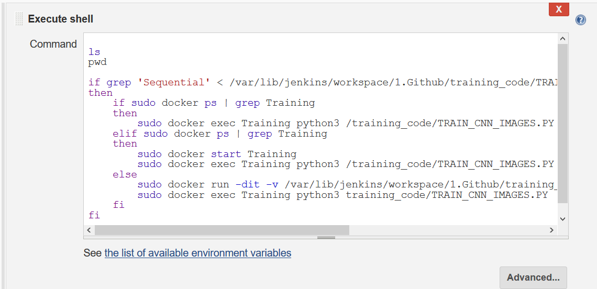

# CNN_Jenkins_Traing

first lets make create dir and after change directory web then create directory 'website' and create file 'Dockerfile'

## Create directory and File
```
$mkdir keras_dockerfile

$cd keras_dockerfile 

$touch Dockerfile
```

Create Simple index.html in Website Folder

## Create Dockerfile

now,
need write code in dockerfile

should be likes this 


```
$vim Dockerfile
```
---


```
FROM centos:7

RUN yum install python3 -y
RUN curl https://bootstrap.pypa.io/get-pip.py -o get-pip.py
RUN python3 get-pip.py
RUN pip3 install tensorflow==1.5
RUN pip3 install keras==2.1.5
```

## Build Image using Dockerfile

lets make build image using dockerfile with python3

```
$docker build -t cnn .
```
note: dot means current directory


# Now we Create job in Jenkins

## JOB 1 (1.Github)


create new job name is Job1 


copy and paste from github url : https://github.com/amantiwari1/keras_model_training.git

go to Source Code Management and tick git


now tick in GitHub hook trigger for GITScm polling


create some shell in copy file


Build other projects


## JOB 2 (2.Launch and Training)


Launch and Training from Docker Container




```

if grep 'Sequential' < /var/lib/jenkins/workspace/1.Github/training_code/TRAIN_CNN_IMAGES.PY 
then 
	if sudo docker ps | grep Training
    then
    	sudo docker exec Training python3 /training_code/TRAIN_CNN_IMAGES.PY
    elif sudo docker ps | grep Training
	then 
		sudo docker start Training 
        sudo docker exec Training python3 /training_code/TRAIN_CNN_IMAGES.PY
	else 
    	sudo docker run -dit -v /var/lib/jenkins/workspace/1.Github/training_code:/training_code --name Training cnn:latest
        sudo docker exec Training python3 training_code/TRAIN_CNN_IMAGES.PY
    fi
fi 
   
```


Build other projects


## JOB 3 (3. Check Accuracy)

Job 3 is to check Accuracy


```
acc=$(< /var/lib/jenkins/workspace/Github/training_code/accuracy.txt)

echo $acc

if [ $acc='true' ]
then
	exit 1
else
	exit 0
fi

```


## JOB 4 (4. Change the code)


if it is 98% percent in the training (joB3) then Stop the Container (exit 0) 


if it is not 98% percent in the training (joB3) then

it needed the change code (hypermenter tuning)  

```
sudo echo -e '\nfilters +=2 \nepochs += 1' >> /var/lib/jenkins/workspace/Github/training_code/tunings.py
```


build trigger if Check Accuary is failed


## JOB 5 (5. Monitor)


now i am going to build some pipelines
